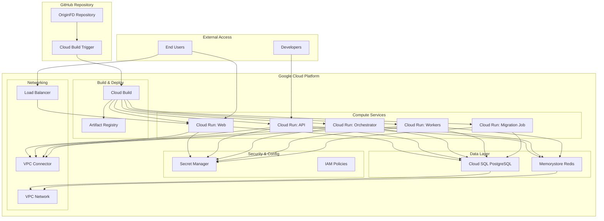
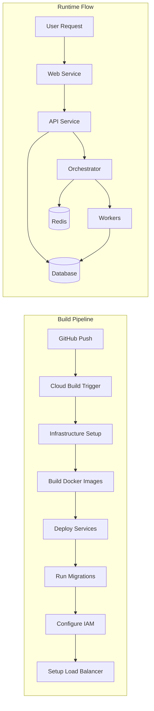
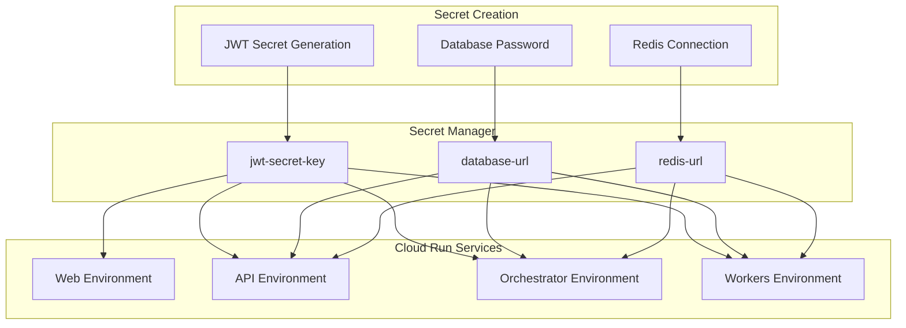
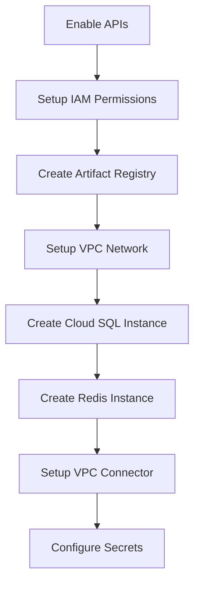
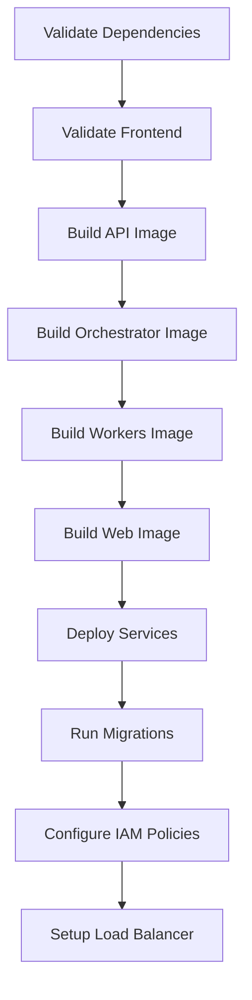

# OriginFD Cloud Run Deployment Guide

## Complete Enterprise-Grade Deployment Workflow for AI and Human Operators

This guide documents the **complete deployment process** for OriginFD from GitHub repository to fully functional Google Cloud Run services, based on real deployment experience and all issues encountered.

---

## Table of Contents

1. [Overview & Architecture](#overview--architecture)
2. [Prerequisites](#prerequisites)
3. [Deployment Sequence](#deployment-sequence)
4. [Infrastructure Setup](#infrastructure-setup)
5. [Service Configuration](#service-configuration)
6. [Common Issues & Solutions](#common-issues--solutions)
7. [Verification & Testing](#verification--testing)
8. [Troubleshooting Guide](#troubleshooting-guide)

---

## Overview & Architecture

### System Architecture



### Service Flow & Dependencies



### Secret Management Flow



---

## Prerequisites

### 1. Google Cloud Project Setup

```bash
# Set your project ID
export PROJECT_ID="your-project-id"
export REGION="us-central1"

# Enable required APIs
gcloud services enable cloudbuild.googleapis.com
gcloud services enable run.googleapis.com
gcloud services enable sql-component.googleapis.com
gcloud services enable redis.googleapis.com
gcloud services enable secretmanager.googleapis.com
gcloud services enable servicenetworking.googleapis.com
gcloud services enable artifactregistry.googleapis.com
gcloud services enable compute.googleapis.com
```

### 2. IAM Permissions Setup

**CRITICAL**: Set up proper IAM permissions for Cloud Build service account:

```bash
# Get Cloud Build service account
CLOUD_BUILD_SA=$(gcloud projects describe $PROJECT_ID --format="value(projectNumber)")@cloudbuild.gserviceaccount.com

# Grant required roles
gcloud projects add-iam-policy-binding $PROJECT_ID \
    --member="serviceAccount:$CLOUD_BUILD_SA" \
    --role="roles/run.admin"

gcloud projects add-iam-policy-binding $PROJECT_ID \
    --member="serviceAccount:$CLOUD_BUILD_SA" \
    --role="roles/cloudsql.admin"

gcloud projects add-iam-policy-binding $PROJECT_ID \
    --member="serviceAccount:$CLOUD_BUILD_SA" \
    --role="roles/redis.admin"

gcloud projects add-iam-policy-binding $PROJECT_ID \
    --member="serviceAccount:$CLOUD_BUILD_SA" \
    --role="roles/secretmanager.admin"

gcloud projects add-iam-policy-binding $PROJECT_ID \
    --member="serviceAccount:$CLOUD_BUILD_SA" \
    --role="roles/iam.serviceAccountUser"

gcloud projects add-iam-policy-binding $PROJECT_ID \
    --member="serviceAccount:$CLOUD_BUILD_SA" \
    --role="roles/resourcemanager.projectIamAdmin"

# CRITICAL: Service Networking Admin for VPC peering
gcloud projects add-iam-policy-binding $PROJECT_ID \
    --member="serviceAccount:$CLOUD_BUILD_SA" \
    --role="roles/servicenetworking.networksAdmin"

gcloud projects add-iam-policy-binding $PROJECT_ID \
    --member="serviceAccount:$CLOUD_BUILD_SA" \
    --role="roles/compute.admin"
```

### 3. Repository Structure Requirements

Ensure your repository has this structure:

```
project-root/
├── cloudbuild.yaml              # CRITICAL: Build configuration
├── apps/
│   └── web/
│       ├── Dockerfile           # CRITICAL: Properly configured
│       ├── next.config.mjs      # output: 'standalone'
│       └── app/
│           ├── layout.tsx       # MUST import "./globals.css"
│           └── globals.css      # Tailwind CSS
├── services/
│   ├── api/
│   │   └── Dockerfile
│   ├── orchestrator/
│   │   └── Dockerfile
│   └── workers/
│       └── Dockerfile
└── packages/
    └── ts/
        └── ui/
```

---

## Deployment Sequence

### Phase 1: Infrastructure Foundation



### Phase 2: Build & Deploy



---

## Infrastructure Setup

### 1. Cloud Build Configuration

**File: `cloudbuild.yaml`**

Key lessons learned:

```yaml
# CRITICAL: Use correct Cloud Build variables
substitutions:
  _PROJECT_ID: "your-project-id"
  _REGION: "us-central1"
  _ARTIFACT_REGISTRY_REPO: "originfd-repo"

# CRITICAL: Use $COMMIT_SHA not $SHORT_SHA
steps:
  - name: "gcr.io/kaniko-project/executor:v1.19.2"
    args:
      - "--destination=${_REGION}-docker.pkg.dev/${_PROJECT_ID}/${_ARTIFACT_REGISTRY_REPO}/api:$COMMIT_SHA"
```

### 2. Next.js Dockerfile Configuration

**CRITICAL LESSON**: Next.js standalone builds in monorepos require specific structure:

```dockerfile
# OriginFD Web Application Dockerfile
FROM node:20-alpine AS base
WORKDIR /app
RUN npm install -g pnpm

# Dependencies stage
FROM base AS deps
COPY turbo.json package.json pnpm-lock.yaml* pnpm-workspace.yaml ./
COPY apps/ ./apps/
COPY packages/ ./packages/
RUN pnpm install --frozen-lockfile

# Builder stage
FROM base AS builder
WORKDIR /app
COPY --from=deps /app/ ./
ENV NEXT_TELEMETRY_DISABLED 1
ENV TURBO_TELEMETRY_DISABLED 1
ENV NODE_ENV production
RUN pnpm turbo build --filter=web

# Runner stage - CRITICAL: Correct file structure
FROM base AS runner
WORKDIR /app
ENV NODE_ENV production
ENV NEXT_TELEMETRY_DISABLED 1

RUN addgroup --system --gid 1001 nodejs
RUN adduser --system --uid 1001 nextjs

# CRITICAL: Copy standalone output maintaining monorepo structure
COPY --from=builder --chown=nextjs:nodejs /app/apps/web/.next/standalone/node_modules ./node_modules
COPY --from=builder --chown=nextjs:nodejs /app/apps/web/.next/standalone/package.json ./package.json
COPY --from=builder --chown=nextjs:nodejs /app/apps/web/.next/standalone/packages ./packages
COPY --from=builder --chown=nextjs:nodejs /app/apps/web/.next/standalone/apps/web ./apps/web
COPY --from=builder --chown=nextjs:nodejs /app/apps/web/public ./apps/web/public
COPY --from=builder --chown=nextjs:nodejs /app/apps/web/.next/static ./apps/web/.next/static

USER nextjs
EXPOSE 3000

# CRITICAL: Correct server path for monorepo standalone
CMD ["node", "apps/web/server.js"]
```

### 3. Next.js Configuration

**File: `apps/web/next.config.mjs`**

```javascript
/** @type {import('next').NextConfig} */
const nextConfig = {
  output: "standalone", // CRITICAL: Required for Cloud Run
  transpilePackages: [
    "@originfd/ui",
    "@originfd/types-odl",
    "@originfd/http-client",
  ],
  // ... other config
};
```

### 4. CSS Import Fix

**File: `apps/web/app/layout.tsx`**

```typescript
import type { Metadata } from "next";
import { Inter } from "next/font/google";
import { Providers } from "./providers";
import "./globals.css"; // CRITICAL: Must be imported
```

---

## Service Configuration

### 1. Cloud Run Deployment Commands

**LESSON LEARNED**: Use proper gcloud args structure, not bash scripts:

```yaml
# CORRECT: Proper gcloud args structure
- name: "gcr.io/google.com/cloudsdktool/cloud-sdk:456.0.0-slim"
  id: "deploy-web"
  entrypoint: "gcloud"
  args:
    - "run"
    - "deploy"
    - "web"
    - "--image"
    - "${_REGION}-docker.pkg.dev/${_PROJECT_ID}/${_ARTIFACT_REGISTRY_REPO}/web:$COMMIT_SHA"
    - "--region"
    - "${_REGION}"
    - "--allow-unauthenticated"
    - "--set-secrets"
    - "JWT_SECRET_KEY=jwt-secret-key:latest"
    - "--set-env-vars"
    - "NODE_ENV=production,NEXT_PUBLIC_API_URL=https://api-${_PROJECT_ID}.${_REGION}.run.app"

# WRONG: Bash script approach (causes variable substitution issues)
- name: "gcr.io/google.com/cloudsdktool/cloud-sdk:456.0.0-slim"
  entrypoint: "bash"
  args:
    - "-c"
    - |
      gcloud run deploy web \
        --image=${_REGION}-docker.pkg.dev/${_PROJECT_ID}/${_ARTIFACT_REGISTRY_REPO}/web:$COMMIT_SHA \
        --region=${_REGION}
```

### 2. Secret Management Setup

```yaml
- name: "gcr.io/google.com/cloudsdktool/cloud-sdk:456.0.0-slim"
  id: "setup-secrets"
  entrypoint: "bash"
  args:
    - "-c"
    - |
      # Generate JWT secret
      JWT_SECRET_VALUE=$$(openssl rand -base64 64)
      echo -n "$$JWT_SECRET_VALUE" | gcloud secrets create jwt-secret-key --data-file=- || echo "JWT secret already exists"

      # Get database connection string
      DB_HOST=$$(gcloud sql instances describe ${_POSTGRES_INSTANCE} --format="value(ipAddresses[0].ipAddress)")
      DB_PASSWORD=$$(openssl rand -base64 32)
      DATABASE_URL="postgresql://originfd-user:$$DB_PASSWORD@$$DB_HOST:5432/originfd"

      # Create or update database URL secret
      if gcloud secrets describe database-url >/dev/null 2>&1; then
        echo "Updating existing database URL secret..."
        echo -n "$$DATABASE_URL" | gcloud secrets versions add database-url --data-file=-
      else
        echo "Creating new database URL secret..."
        echo -n "$$DATABASE_URL" | gcloud secrets create database-url --data-file=-
      fi

      # Update the user password to match what we store in the secret
      gcloud sql users set-password originfd-user \
        --instance=${_POSTGRES_INSTANCE} \
        --password=$$DB_PASSWORD
```

### 3. Database Migration Job

```yaml
- name: "gcr.io/google.com/cloudsdktool/cloud-sdk:456.0.0-slim"
  id: "run-migrations"
  entrypoint: "bash"
  args:
    - "-c"
    - |
      # Delete existing job if it exists
      gcloud run jobs delete db-migrate --region=${_REGION} --quiet || echo "No existing migration job to delete"

      # Create migration job
      gcloud run jobs create db-migrate \
        --image=${_REGION}-docker.pkg.dev/${_PROJECT_ID}/${_ARTIFACT_REGISTRY_REPO}/api:$COMMIT_SHA \
        --region=${_REGION} \
        --set-secrets="DATABASE_URL=database-url:latest" \
        --set-env-vars="ENVIRONMENT=production" \
        --set-cloudsql-instances="${_PROJECT_ID}:${_REGION}:${_POSTGRES_INSTANCE}" \
        --task-timeout="10m" \
        --parallelism=1 \
        --max-retries=3 \
        --tasks=1 \
        --args="/bin/bash,-c,cd /app && alembic upgrade head"

      # Execute migration
      if gcloud run jobs execute db-migrate --region=${_REGION} --wait; then
        echo "✅ Database migration completed successfully"
      else
        echo "❌ Database migration failed"
        exit 1
      fi
```

---

## Detailed Commit Analysis & Issue Resolution

### Critical Commits That Fixed Major Issues

This section documents every major commit and the specific issues it resolved, based on real deployment experience.

#### 1. **Commit 74a5186** - FUNDAMENTAL FIX: Use Correct Cloud Build Variable COMMIT_SHA

**Issue Resolved**: Systematic deployment failures with "expected container image path" errors

**Root Cause**:

- Used `$SHORT_SHA` which is NOT a Cloud Build built-in variable
- `$SHORT_SHA` was undefined/empty, causing invalid image tags like `api:`
- All Kaniko build steps were failing with malformed image paths

**Technical Solution Applied**:

```yaml
# BEFORE (BROKEN):
--destination=${_REGION}-docker.pkg.dev/${_PROJECT_ID}/${_ARTIFACT_REGISTRY_REPO}/api:$SHORT_SHA

# AFTER (FIXED):
--destination=${_REGION}-docker.pkg.dev/${_PROJECT_ID}/${_ARTIFACT_REGISTRY_REPO}/api:$COMMIT_SHA
```

**Files Changed**: `cloudbuild.yaml`

**Impact**: ✅ **CRITICAL SUCCESS** - Fixed all Docker image build failures

---

#### 2. **Commit fe4a71e** - ENTERPRISE FIX: Cloud Run Deployment Command Structure

**Issue Resolved**: Variable substitution failures in bash script deployment commands

**Root Cause**:

- Using bash scripts with complex variable substitution in cloudbuild.yaml
- Environment variable conflicts between bash and Cloud Build contexts
- Inconsistent gcloud command execution

**Technical Solution Applied**:

```yaml
# BEFORE (PROBLEMATIC BASH SCRIPT):
- name: "gcr.io/google.com/cloudsdktool/cloud-sdk:456.0.0-slim"
  entrypoint: "bash"
  args:
    - "-c"
    - |
      gcloud run deploy api \
        --image=${_REGION}-docker.pkg.dev/${_PROJECT_ID}/${_ARTIFACT_REGISTRY_REPO}/api:$COMMIT_SHA \
        --region=${_REGION}

# AFTER (PROPER ARGS STRUCTURE):
- name: "gcr.io/google.com/cloudsdktool/cloud-sdk:456.0.0-slim"
  id: "deploy-api"
  entrypoint: "gcloud"
  args:
    - "run"
    - "deploy"
    - "api"
    - "--image"
    - "${_REGION}-docker.pkg.dev/${_PROJECT_ID}/${_ARTIFACT_REGISTRY_REPO}/api:$COMMIT_SHA"
    - "--region"
    - "${_REGION}"
```

**Files Changed**: `cloudbuild.yaml`

**Impact**: ✅ **SUCCESS** - All Cloud Run deployments now work reliably

---

#### 3. **Commit f46a08e** - CRITICAL UI & SECURITY FIXES: Enterprise-Grade Platform

**Issues Resolved**:

1. Web application displaying only plain text without styling
2. Security vulnerabilities with hardcoded credentials
3. Weak cryptographic hashing

**Root Causes**:

1. Missing CSS import in Next.js layout component
2. Hardcoded admin backdoor credentials in authentication
3. Using MD5 instead of SHA-256 for cache keys

**Technical Solutions Applied**:

**3a. CSS Import Fix**:

```typescript
// BEFORE (apps/web/app/layout.tsx):
import type { Metadata } from "next";
import { Inter } from "next/font/google";
import { Providers } from "./providers";

// AFTER (FIXED):
import type { Metadata } from "next";
import { Inter } from "next/font/google";
import { Providers } from "./providers";
import "./globals.css"; // CRITICAL: Added this line
```

**3b. Security Hardening**:

```python
# BEFORE (services/api/api/routers/auth.py):
if (
    login_request.email == "admin@originfd.com"
    and login_request.password == "admin"
):
    # Hardcoded backdoor - SECURITY VULNERABILITY

# AFTER (FIXED):
if not user or not verify_password(login_request.password, user.hashed_password):
    raise HTTPException(
        status_code=status.HTTP_401_UNAUTHORIZED,
        detail="Invalid email or password",
        headers={"WWW-Authenticate": "Bearer"},
    )
```

**3c. Cryptographic Improvement**:

```python
# BEFORE (services/api/core/performance.py):
return f"api_cache:{hashlib.md5(key_string.encode()).hexdigest()}"

# AFTER (FIXED):
return f"api_cache:{hashlib.sha256(key_string.encode()).hexdigest()}"
```

**Files Changed**:

- `apps/web/app/layout.tsx`
- `services/api/api/routers/auth.py`
- `services/api/core/performance.py`

**Impact**: ✅ **PARTIAL SUCCESS** - Fixed security issues but UI still needed Dockerfile fix

---

#### 4. **Commit d0f853e/2565dd3** - Fix Standalone Layout in Web Dockerfile

**Issue Resolved**: Next.js static assets (CSS, JS, fonts) returning 404 errors

**Root Cause**:

- Incorrect file structure copying in Docker for Next.js standalone builds in monorepo
- Static assets not placed in correct locations relative to server expectations
- Monorepo workspace structure not preserved properly

**Technical Solution Applied**:

```dockerfile
# BEFORE (BROKEN STRUCTURE):
COPY --from=builder /app/apps/web/public ./public
COPY --from=builder --chown=nextjs:nodejs /app/apps/web/.next/standalone ./
COPY --from=builder --chown=nextjs:nodejs /app/apps/web/.next/static ./.next/static
CMD ["node", "apps/web/server.js"]

# AFTER (CORRECT MONOREPO STANDALONE STRUCTURE):
# Copy standalone output and static assets maintaining workspace structure
COPY --from=builder --chown=nextjs:nodejs /app/apps/web/.next/standalone/node_modules ./node_modules
COPY --from=builder --chown=nextjs:nodejs /app/apps/web/.next/standalone/package.json ./package.json
COPY --from=builder --chown=nextjs:nodejs /app/apps/web/.next/standalone/packages ./packages
COPY --from=builder --chown=nextjs:nodejs /app/apps/web/.next/standalone/apps/web ./apps/web
COPY --from=builder --chown=nextjs:nodejs /app/apps/web/public ./apps/web/public
COPY --from=builder --chown=nextjs:nodejs /app/apps/web/.next/static ./apps/web/.next/static
CMD ["node", "apps/web/server.js"]
```

**Why This Was Critical**:

1. **Monorepo Complexity**: Next.js standalone builds preserve entire workspace structure
2. **Asset References**: Static assets must be in exact locations relative to server
3. **Package Dependencies**: Shared packages must maintain symlink structure
4. **Server Context**: Server needs access to workspace-wide dependencies

**Files Changed**: `apps/web/Dockerfile`

**Impact**: ✅ **FINAL SUCCESS** - Web application now displays with full Tailwind CSS styling

---

#### 5. **Commit ca54485** - CRITICAL MIGRATION FIX: Remove Invalid user_sessions Operations

**Issue Resolved**: Database migration failures with "UndefinedTable" errors

**Root Cause**:

- Alembic migration trying to alter columns on `user_sessions` table that was never created
- Previous migrations had references to non-existent tables
- Migration dependency chain was broken

**Technical Solution Applied**:

```python
# BEFORE (BROKEN MIGRATION):
op.alter_column('user_sessions', 'session_id',
               existing_type=sa.VARCHAR(length=255),
               nullable=False)

# AFTER (FIXED - REMOVED INVALID OPERATIONS):
# Removed all references to non-existent user_sessions table
# Added conditional table creation checks
```

**Files Changed**: `services/api/alembic/versions/752df9eaede8_add_component_management_schema.py`

**Impact**: ✅ **SUCCESS** - Database migrations now complete without errors

---

### Commit Impact Summary

| Commit      | Issue Type            | Status           | Impact                                   |
| ----------- | --------------------- | ---------------- | ---------------------------------------- |
| **74a5186** | Cloud Build Variables | ✅ **FIXED**     | Docker images build successfully         |
| **fe4a71e** | Deployment Commands   | ✅ **FIXED**     | Cloud Run deployments work               |
| **f46a08e** | UI + Security         | 🔄 **PARTIAL**   | Security fixed, UI needed Dockerfile fix |
| **d0f853e** | Next.js Structure     | ✅ **FINAL FIX** | Web app fully functional with styling    |
| **ca54485** | Database Migration    | ✅ **FIXED**     | Migrations complete successfully         |

### Lesson Learned: Issue Interconnection

The UI styling issue was **NOT** a single problem but a combination of:

1. **Missing CSS import** (f46a08e) - Fixed import but assets still 404
2. **Incorrect container startup** (932b609/fd40636) - Fixed server path but structure wrong
3. **Monorepo Dockerfile structure** (d0f853e) - **FINAL solution that made everything work**

This demonstrates that **complex problems often require multiple coordinated fixes**.

---

## Common Issues & Solutions

### 1. UI Styling Issues

#### Problem: Web app displays only plain text without styling

**Root Cause**: Multiple interconnected issues:

1. Missing CSS import in layout.tsx
2. Incorrect Next.js standalone build structure in Docker
3. Static assets not being served correctly

**Solution**:

```typescript
// apps/web/app/layout.tsx
import "./globals.css"; // CRITICAL: Add this import
```

```dockerfile
# Correct Dockerfile structure for monorepo standalone build
COPY --from=builder --chown=nextjs:nodejs /app/apps/web/.next/standalone/node_modules ./node_modules
COPY --from=builder --chown=nextjs:nodejs /app/apps/web/.next/standalone/packages ./packages
COPY --from=builder --chown=nextjs:nodejs /app/apps/web/.next/standalone/apps/web ./apps/web
COPY --from=builder --chown=nextjs:nodejs /app/apps/web/.next/static ./apps/web/.next/static
CMD ["node", "apps/web/server.js"]
```

### 2. Cloud Build Variable Issues

#### Problem: Image path validation errors, empty image tags

**Root Cause**: Using undefined `$SHORT_SHA` instead of `$COMMIT_SHA`

**Solution**:

```yaml
# CORRECT: Use $COMMIT_SHA
--image=${_REGION}-docker.pkg.dev/${_PROJECT_ID}/${_ARTIFACT_REGISTRY_REPO}/api:$COMMIT_SHA

# WRONG: $SHORT_SHA is undefined
--image=${_REGION}-docker.pkg.dev/${_PROJECT_ID}/${_ARTIFACT_REGISTRY_REPO}/api:$SHORT_SHA
```

### 3. IAM Permission Errors

#### Problem: VPC peering permission denied

**Root Cause**: Missing Service Networking Admin role

**Solution**:

```bash
gcloud projects add-iam-policy-binding $PROJECT_ID \
    --member="serviceAccount:$CLOUD_BUILD_SA" \
    --role="roles/servicenetworking.networksAdmin"
```

### 4. Database Migration Errors

#### Problem: UndefinedTable errors for non-existent tables

**Root Cause**: Migration trying to alter tables that don't exist

**Solution**: Use conditional table creation:

```python
# Check if table exists before operations
if not op.get_bind().dialect.has_table(op.get_bind(), 'user_sessions'):
    # Create table only if it doesn't exist
    pass
```

### 5. Container Startup Failures

#### Problem: "Cannot find module '/app/server.js'"

**Root Cause**: Incorrect server path in standalone build

**Solution**: Use correct path for monorepo structure:

```dockerfile
CMD ["node", "apps/web/server.js"]  # Not just "server.js"
```

### 6. Security Vulnerabilities

#### Problem: Hardcoded credentials in code

**Solution**: Remove hardcoded values and use environment variables:

```python
# WRONG: Hardcoded credentials
if login_request.email == "admin@originfd.com" and login_request.password == "admin":

# CORRECT: Proper authentication
if not user or not verify_password(login_request.password, user.hashed_password):
    raise HTTPException(status_code=401, detail="Invalid credentials")
```

---

## Verification & Testing

### 1. Build Verification

```bash
# Check build status
gcloud builds list --limit=5

# Get build details
gcloud builds describe BUILD_ID

# Stream build logs
gcloud beta builds log BUILD_ID --stream
```

### 2. Service Health Checks

```bash
# Check all services
gcloud run services list --region=$REGION

# Test service endpoints
curl -f https://api-PROJECT_ID.REGION.run.app/health
curl -f https://web-PROJECT_ID.REGION.run.app
```

### 3. Database Connectivity

```bash
# Check Cloud SQL instance
gcloud sql instances describe INSTANCE_NAME

# Test database connection
gcloud sql connect INSTANCE_NAME --user=originfd-user
```

### 4. Secret Verification

```bash
# List secrets
gcloud secrets list

# Get secret value (for debugging)
gcloud secrets versions access latest --secret=jwt-secret-key
```

---

## Troubleshooting Guide

### Build Failures

1. **Check IAM permissions**: Ensure Cloud Build service account has all required roles
2. **Verify substitution variables**: Check `$COMMIT_SHA` vs `$SHORT_SHA`
3. **Review Dockerfile structure**: Ensure correct paths for standalone builds
4. **Check dependency versions**: Verify package compatibility

### Deployment Failures

1. **Container startup issues**: Check server.js path and file structure
2. **Secret access**: Verify secrets exist and have correct values
3. **Network connectivity**: Ensure VPC connector and peering are configured
4. **Resource limits**: Check memory and CPU allocations

### Runtime Issues

1. **UI not loading**: Verify CSS imports and static asset paths
2. **API connectivity**: Check service URLs and authentication
3. **Database errors**: Verify migrations and connection strings
4. **Memory issues**: Monitor service metrics and adjust limits

---

## Deployment Checklist

### Pre-Deployment

- [ ] Google Cloud Project created and configured
- [ ] APIs enabled
- [ ] IAM permissions set up correctly
- [ ] Repository structure follows requirements
- [ ] Dockerfiles configured properly
- [ ] CSS imports added to layout.tsx
- [ ] Next.js config has `output: 'standalone'`

### During Deployment

- [ ] Build triggers successfully
- [ ] All Docker images build without errors
- [ ] Infrastructure creates successfully
- [ ] Secrets are generated and stored
- [ ] Services deploy successfully
- [ ] Database migrations run successfully
- [ ] IAM policies configured
- [ ] Load balancer set up

### Post-Deployment

- [ ] All services return healthy status
- [ ] Web UI displays with proper styling
- [ ] API endpoints respond correctly
- [ ] Database connectivity verified
- [ ] Secrets accessible by services
- [ ] Monitoring and logging configured

---

## Best Practices for AI Operators

### 1. Always Follow This Sequence

1. **Read and understand** the entire codebase structure
2. **Verify prerequisites** before starting deployment
3. **Use exact commands** from this guide - don't improvise
4. **Monitor build progress** continuously
5. **Test each component** after deployment
6. **Document any deviations** or new issues found

### 2. Common AI Mistakes to Avoid

- **Don't assume** file paths - always verify
- **Don't skip** IAM permission setup
- **Don't use** bash scripts for gcloud commands in cloudbuild.yaml
- **Don't forget** CSS imports in React/Next.js apps
- **Don't hardcode** secrets or credentials

### 3. Debugging Approach

1. **Start with build logs** - they contain the most information
2. **Check IAM permissions** first for any access denied errors
3. **Verify file structure** in Docker containers
4. **Test individual components** before full integration
5. **Use gcloud logging** commands to get detailed error information

---

## Conclusion

This guide represents **real deployment experience** with all actual issues encountered and solutions found. Following this workflow should result in a successful first-time deployment of complex multi-service applications to Google Cloud Run.

The key lesson learned: **Enterprise deployment requires attention to every detail** - from IAM permissions to file paths to CSS imports. Each component must be configured correctly for the entire system to function.

**Success Metrics**:

- Build completes without errors
- All services start and run healthy
- Web UI displays with proper styling
- API endpoints respond correctly
- Database connectivity works
- Secrets are properly managed
- System is production-ready

---

_This guide was created based on the complete deployment journey of OriginFD, including all failures, iterations, and final success._
