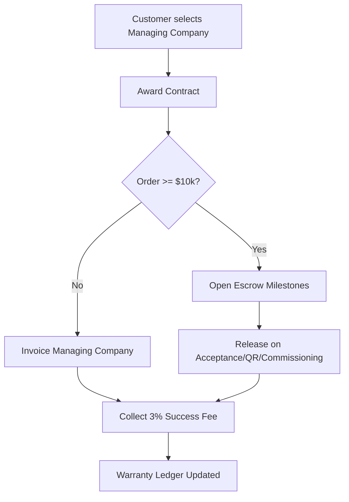
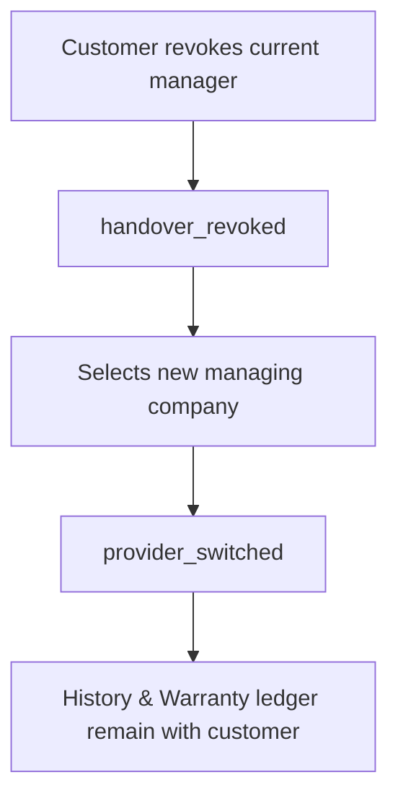

# ODL-SD Monetisation & Commercial Policy v1.2 (Final-Rev2)

**Status:** Final • **Supersedes:** v1.1 • **Date:** 2025-08-31

**Purpose:** Full and final commercial canon for the ODL‑SD Platform. This revision incorporates final polish from the latest peer review: backward‑compatibility, clearer definitions, additional examples, escrow release triggers, crypto pilot terms, Right‑to‑Switch details, audit‑retention, referral metrics, and a new Provider‑Switch flow, while preserving our **simple money story** and anti‑exploitation posture.

> **Simple Money Story (unchanged):**
>
> 1. **Subscriptions** — Free, Pro (per user), Enterprise (org + own domain/SSO).
> 2. **Transactions** — flat, visible fees on (a) components orders and (b) service handovers; payment processing is shown **at cost**.
> 3. **Design Marketplace** — transparent platform take‑rate on digital design/template sales with clear royalty splits.

---

## 0. Executive Summary

- **Backward compatibility:** Customers on v1.0/v1.1 pricing are **grandfathered** on current cycle; new quotas/rules apply from next renewal unless they opt‑in earlier. Change notices per §13.
- **What’s new in v1.2:** clarified **definitions** (e.g., _Design Template_), **trial‑extension rule** via referral, **escrow release triggers** linked to governance events (QR/commissioning), **multi‑currency examples**, **transparency dashboard**, **referral metrics targets**, **community contributor** rewards, **cohort analysis** KPI, **crypto pilot terms**, **force majeure**, **Right‑to‑Switch**, expanded enums & error examples, **audit retention** policy, new **Provider‑Switch** flow.

---

## 1. Terminology & Conventions

- **Standards:** JSON Schema **2020‑12**; time **UTC ISO‑8601** (`YYYY‑MM‑DDTHH:MM:SSZ`); money stored in **minor units** with **ISO‑4217** currency; IDs are **ULIDs** (preferred) or UUIDv4.
- **Commerce metrics:** **MRR/ARR**, **GMV**, **Take‑rate**, **Churn** (logo/$), **ARPU**.
- **AI metering:** **Premium Simulation Unit (PSU)** = a heavy compute (e.g., Monte Carlo, irradiance HPC, grid short‑circuit).
- **Escrow:** funds held until delivery acceptance/milestones.
- **Data classification:** `public|internal|confidential|restricted`.
- **Negative amounts:** refunds/chargebacks are negative ledger events.
- **Payments rails:** card/ACH/SEPA/bank transfer; **crypto pilot**: stablecoins (USDC) via regulated custodians, KYC/AML mandatory, enterprise‑only, off by default.
- **Design Template:** ODL‑SD‑compliant, reusable design asset (data + constraints + BOM rules) suitable for parameterised re‑use and customisation via governed change requests.

---

## 2. Product Packaging (simple & predictable)

### 2.1 Plans

| Plan                 |                    Price | For                                | Includes                                                                                                                                                                                                      |
| -------------------- | -----------------------: | ---------------------------------- | ------------------------------------------------------------------------------------------------------------------------------------------------------------------------------------------------------------- |
| **Free**             |                       $0 | Consumers & trials                 | **3 designs/mo**, 1 active project, basic wiring checks, export preview (watermark), read‑only **warranty ledger**, 1‑click handover & carting                                                                |
| **Pro (per user)**   | **$79/user/mo** (anchor) | Engineers, PM, Finance, Legal, Ops | **Unlimited projects**, advanced AI checks & simulations (**includes 100 PSUs/mo/user** fair‑use), full exports, procurement & installation workflows, **all roles included**, team dashboards, email support |
| **Enterprise (org)** |      **$25k/yr + seats** | Larger orgs & brands               | All Pro + **own domain/SSO**, APIs/connectors, SIEM webhooks, SLAs, data retention, dedicated success                                                                                                         |

**Optional Add‑Ons (flat, transparent):**

- **AI Boost Pack:** +**250 PSUs/mo/user** (stackable); keeps costs predictable (no per‑run micro‑billing).
- **Sustainability Pack:** carbon accounting, **PPA/ESG/REC & carbon‑credit** integrations and reports.
- **Connectors Pack:** IFC/CIM/PVsyst/PSCAD, ERP/CRM bridges.

**Trial extension (growth rule):** high‑engagement Free users may auto‑unlock **+2 designs** for 7 days by completing a referral or publishing a public read‑only design link (one‑time per account).

### 2.2 Transaction Fees (visible)

- **Components marketplace:** **5%** platform fee, **charged to supplier** on payout; payment processing **at cost**.
- **Service handover:** **3%** success fee, **charged to managing company** upon award.

### 2.3 Design Marketplace

- **Direct template sale (digital good):** Designer **85%**, Platform **15%** (processing at cost).
- **Enterprise resale of Pro’s template:** Platform **10%**, **Designer 30%**, **Enterprise 60%** (defaults; custom `RevenueSharePolicy` MAY override with clear disclosure).
- **Anti‑plagiarism & DMCA:** fingerprinting, takedowns, strike policy; royalties paused during dispute.
- **Escrow for customisation:** funds released on milestones tied to governance events (see §10/§9.6).

---

## 3. Commercial Rules

### 3.1 Localisation, Taxes, FX

- Local prices by currency/region; taxes computed per jurisdiction and item type.
- **FX policy:** rates snapshot daily; Enterprise payouts MAY hedge via `FXHedgePolicy`.

### 3.2 Billing & Proration

- Monthly default; **annual prepay** (10% discount). Upgrades prorate immediately; downgrades next cycle.
- Trials are time‑bound; on expiry revert to Free.

### 3.3 Coupons, Credits, Anti‑Fraud

- Coupons: exclusive or stackable; per‑account & per‑payment‑fingerprint limits; IP/device risk checks. High‑value promos MAY require KYC. Abuse → revoke/ban (audited).
- Credits are non‑withdrawable; refunds go to original method unless law dictates otherwise.

### 3.4 Refunds, Returns, Chargebacks

- **Refund windows:** digital subscriptions: **30 days** where required; **EU** consumer **14‑day cooling‑off** (digital access caveats apply).
- Physical goods: supplier RMA governs; platform adjusts payouts.
- Chargebacks: evidence auto‑compiled from audit logs; target **<1%** disputes.

### 3.5 Fair‑Use

- **Pro** includes **100 PSUs/mo/user**. On exceed: suggest **Boost Pack**. Abuse → rate‑limit → suspend with appeal path.

### 3.6 Escrow (≥ $10k orders)

- Default to escrow with **milestone releases**: Acceptance → Shipment → Commissioning. Release triggers are governance‑event‑linked (e.g., **QR scan at site** → `commissioning_started`). Disputes pause release.

---

## 4. Trust & Transparency UX

- **Checkout:** item total, taxes, **processing at cost**, platform fees visible on counterpart statements.
- **Fee/payout calculator:** real‑time widget.
- **Self‑serve audit:** invoices, orders, payouts, disputes, governance events.
- **Transparency Dashboard:** personal and org views showing: total fees paid/earned, savings vs. quoted market, carbon impact (if Sustainability Pack), and referral impact.

---

## 5. Marketing Programs

- **Launch (time‑boxed):** Founders’ −20% Pro; Enterprise Pilot (90‑day); Supplier Onboarding Rebate (0% platform fee for first $X GMV).
- **Always‑On:** Referral credits; Education/Non‑profit pricing; **Affiliate Program** (influencers/installers) with tracked commissions.
- **Community Contributor:** top‑rated marketplace designers earn **temporary Pro credits** or feature placement.
- **Targets:** Referral conversion **≥ 15%**; Affiliate CAC payback **≤ 3 months**.

---

## 6. KPIs & Targets

- **North Star:** % designs that become **published baselines**.
- **Growth:** Free→Pro conversion; **MRR churn < 5%**; ARPU; GMV; take‑rate.
- **AI efficacy:** designs→orders conversion; PSUs per successful order.
- **Cohort analysis:** monthly retention by plan/region/industry; identify lift from Boost Packs and Sustainability Pack.
- **Sustainability:** estimated CO₂e avoided; % projects with Sustainability Pack.

---

## 7. Implementation & Integrations

- **Payments:** Stripe (global), Adyen (multi‑rail); bank transfers via open banking where available.
- **Taxes:** TaxJar/Avalara.
- **Escrow:** licensed partners; release webhooks.
- **APIs:** rate limits per plan; sandbox keys; idempotency on all POSTs.
- **Webhooks (expanded):** `payment.succeeded`, `payment.failed`, `refund.succeeded`, `dispute.opened`, `dispute.closed`, `escrow.opened`, `escrow.released`, `escrow.disputed`, `payout.queued`, `payout.paid`.
- **Crypto pilot terms:** enterprise‑only, **USDC** on approved chains, KYC/AML required, conversion to fiat at payout; not available in restricted jurisdictions.

---

## 8. Legal & Ethics (summaries)

- **Data privacy:** GDPR/CCPA compliant; opt‑out of analytics where required; enterprise data residency controls.
- **AI liability:** outputs are assistance; engineering sign‑off remains with user/company; exports include model version & assumptions.
- **Design IP:** originality warranted; DMCA‑style takedown; repeat offenders removed; royalties paused during dispute.
- **Right‑to‑Switch:** customers can revoke a managing company and appoint another; warranty ledger & project history remain with customer; handover rescission/refunds follow §9.7/§10 flows.
- **Force Majeure:** platform and counterparties excused for events beyond reasonable control (e.g., natural disasters, war, systemic network outages) with best‑effort mitigation and communication.
- **Policy versioning:** 30‑day notice for material changes via in‑app + email; archives hosted.

---

## 9. JSON Schemas (Canonical)

> JSON Schema **2020‑12**; amounts in **minor units**; arrays capped (`maxItems`) to limit abuse. New/changed definitions marked _(amended/new)_.

### 9.1 Base Types _(amended)_

```json
{
  "$id": "https://odl.sd/schemas/base.json",
  "$schema": "https://json-schema.org/draft/2020-12/schema",
  "title": "ODL-SD Base Types",
  "type": "object",
  "definitions": {
    "ULID": { "type": "string", "pattern": "^[0-9A-HJKMNP-TV-Z]{26}$" },
    "ISO8601": { "type": "string", "format": "date-time" },
    "Currency": { "type": "string", "pattern": "^[A-Z]{3}$" },
    "Email": { "type": "string", "format": "email" },
    "Money": {
      "type": "object",
      "required": ["amount_minor", "currency"],
      "properties": {
        "amount_minor": { "type": "integer" },
        "currency": { "$ref": "#/definitions/Currency" }
      }
    },
    "Percentage": { "type": "number", "minimum": 0, "maximum": 100 },
    "Classification": {
      "type": "string",
      "enum": ["public", "internal", "confidential", "restricted"]
    },
    "UserRef": {
      "type": "object",
      "required": ["user_id"],
      "properties": {
        "user_id": { "$ref": "#/definitions/ULID" },
        "email": { "$ref": "#/definitions/Email" }
      }
    },
    "OrgRef": {
      "type": "object",
      "required": ["org_id"],
      "properties": { "org_id": { "$ref": "#/definitions/ULID" } }
    },
    "Audit": {
      "type": "object",
      "required": ["created_at", "created_by"],
      "properties": {
        "created_at": { "$ref": "#/definitions/ISO8601" },
        "created_by": { "$ref": "#/definitions/UserRef" },
        "updated_at": { "$ref": "#/definitions/ISO8601" },
        "updated_by": { "$ref": "#/definitions/UserRef" },
        "classification": { "$ref": "#/definitions/Classification" }
      }
    }
  }
}
```

### 9.2 Plans, Subscriptions, Fair‑Use _(amended)_

```json
{
  "$id": "https://odl.sd/schemas/plan_subscription.json",
  "$schema": "https://json-schema.org/draft/2020-12/schema",
  "title": "Plans, Subscriptions & Fair-Use",
  "type": "object",
  "definitions": {
    "PlanCode": { "type": "string", "enum": ["FREE", "PRO", "ENTERPRISE"] },
    "Role": {
      "type": "string",
      "enum": [
        "engineer",
        "project_manager",
        "finance",
        "legal",
        "operations",
        "org_admin",
        "viewer"
      ]
    },
    "Plan": {
      "type": "object",
      "required": ["plan_id", "code", "name", "recurring", "features"],
      "properties": {
        "plan_id": {
          "$ref": "https://odl.sd/schemas/base.json#/definitions/ULID"
        },
        "code": { "$ref": "#/definitions/PlanCode" },
        "name": { "type": "string" },
        "recurring": {
          "type": "string",
          "enum": ["monthly", "annual", "none"]
        },
        "price": {
          "$ref": "https://odl.sd/schemas/base.json#/definitions/Money"
        },
        "included_roles": {
          "type": "array",
          "items": { "$ref": "#/definitions/Role" },
          "maxItems": 20
        },
        "features": {
          "type": "array",
          "items": { "type": "string" },
          "maxItems": 200
        },
        "fair_use": { "type": "string" }
      }
    },
    "Subscription": {
      "type": "object",
      "required": [
        "subscription_id",
        "org_id",
        "plan_code",
        "status",
        "seats",
        "billing_cycle"
      ],
      "properties": {
        "subscription_id": {
          "$ref": "https://odl.sd/schemas/base.json#/definitions/ULID"
        },
        "org_id": {
          "$ref": "https://odl.sd/schemas/base.json#/definitions/ULID"
        },
        "plan_code": { "$ref": "#/definitions/PlanCode" },
        "status": {
          "type": "string",
          "enum": ["active", "trial", "past_due", "canceled"]
        },
        "seats": { "type": "integer", "minimum": 0 },
        "billing_cycle": { "type": "string", "enum": ["monthly", "annual"] },
        "trial_ends_at": {
          "$ref": "https://odl.sd/schemas/base.json#/definitions/ISO8601"
        },
        "coupon": { "type": "string" },
        "audit": {
          "$ref": "https://odl.sd/schemas/base.json#/definitions/Audit"
        }
      }
    },
    "AIUsageMeter": {
      "type": "object",
      "required": [
        "org_id",
        "user_id",
        "period_start",
        "period_end",
        "psu_used"
      ],
      "properties": {
        "org_id": {
          "$ref": "https://odl.sd/schemas/base.json#/definitions/ULID"
        },
        "user_id": {
          "$ref": "https://odl.sd/schemas/base.json#/definitions/ULID"
        },
        "period_start": {
          "$ref": "https://odl.sd/schemas/base.json#/definitions/ISO8601"
        },
        "period_end": {
          "$ref": "https://odl.sd/schemas/base.json#/definitions/ISO8601"
        },
        "psu_used": { "type": "integer", "minimum": 0 },
        "psu_included": { "type": "integer", "minimum": 0 },
        "psu_boost": { "type": "integer", "minimum": 0 }
      }
    },
    "FairUsePolicy": {
      "type": "object",
      "required": ["plan_code", "psu_included"],
      "properties": {
        "plan_code": { "$ref": "#/definitions/PlanCode" },
        "psu_included": { "type": "integer", "minimum": 0 },
        "burst_limit": { "type": "integer", "minimum": 0 }
      }
    }
  }
}
```

### 9.3 Enterprise White‑Label & SSO _(amended)_

```json
{
  "$id": "https://odl.sd/schemas/enterprise.json",
  "$schema": "https://json-schema.org/draft/2020-12/schema",
  "title": "Enterprise White-Label & SSO",
  "type": "object",
  "definitions": {
    "WhiteLabel": {
      "type": "object",
      "required": ["org_id", "domain"],
      "properties": {
        "org_id": {
          "$ref": "https://odl.sd/schemas/base.json#/definitions/ULID"
        },
        "domain": { "type": "string", "format": "hostname" },
        "brand": {
          "type": "object",
          "properties": {
            "logo_url": { "type": "string", "format": "uri" },
            "primary_color": { "type": "string" }
          }
        },
        "sso": {
          "type": "object",
          "properties": {
            "saml": { "type": "object" },
            "oidc": { "type": "object" }
          }
        },
        "role_mapping": {
          "type": "object",
          "additionalProperties": { "type": "string" }
        },
        "siem": {
          "type": "object",
          "properties": { "webhook_url": { "type": "string", "format": "uri" } }
        },
        "data_residency": {
          "type": "string",
          "enum": ["US", "EU", "APAC", "AUTO"]
        },
        "audit": {
          "$ref": "https://odl.sd/schemas/base.json#/definitions/Audit"
        }
      }
    }
  }
}
```

### 9.4 Promotions, Refunds & Credits _(amended + new `CouponValidationResult`)_

```json
{
  "$id": "https://odl.sd/schemas/commercial_rules.json",
  "$schema": "https://json-schema.org/draft/2020-12/schema",
  "title": "Commercial Rules",
  "type": "object",
  "definitions": {
    "PricingRule": {
      "type": "object",
      "required": ["rule_id", "scope"],
      "properties": {
        "rule_id": {
          "$ref": "https://odl.sd/schemas/base.json#/definitions/ULID"
        },
        "scope": {
          "type": "string",
          "enum": ["global", "region", "currency", "org", "plan"]
        },
        "currency": {
          "$ref": "https://odl.sd/schemas/base.json#/definitions/Currency"
        },
        "percent_discount": {
          "$ref": "https://odl.sd/schemas/base.json#/definitions/Percentage"
        },
        "fixed_discount": {
          "$ref": "https://odl.sd/schemas/base.json#/definitions/Money"
        },
        "starts_at": {
          "$ref": "https://odl.sd/schemas/base.json#/definitions/ISO8601"
        },
        "ends_at": {
          "$ref": "https://odl.sd/schemas/base.json#/definitions/ISO8601"
        },
        "stacking": {
          "type": "string",
          "enum": ["exclusive", "stackable", "max_one_percent", "max_one_fixed"]
        },
        "anti_fraud": {
          "type": "object",
          "properties": {
            "per_account_limit": { "type": "integer", "minimum": 1 },
            "per_payment_fingerprint_limit": {
              "type": "integer",
              "minimum": 1
            },
            "ip_rate_limit_per_day": { "type": "integer", "minimum": 1 }
          }
        }
      }
    },
    "Coupon": {
      "type": "object",
      "required": ["code", "rule_id"],
      "properties": {
        "code": { "type": "string" },
        "rule_id": {
          "$ref": "https://odl.sd/schemas/base.json#/definitions/ULID"
        },
        "max_redemptions": { "type": "integer", "minimum": 1 },
        "per_customer_limit": { "type": "integer", "minimum": 1 }
      }
    },
    "CouponValidationResult": {
      "type": "object",
      "required": ["status"],
      "properties": {
        "status": { "type": "string", "enum": ["accepted", "rejected"] },
        "reason": {
          "type": "string",
          "enum": [
            "expired",
            "invalid_code",
            "limit_reached",
            "not_applicable",
            "fraud_suspected"
          ]
        }
      }
    },
    "Refund": {
      "type": "object",
      "required": ["refund_id", "payment_id", "amount", "reason"],
      "properties": {
        "refund_id": {
          "$ref": "https://odl.sd/schemas/base.json#/definitions/ULID"
        },
        "payment_id": {
          "$ref": "https://odl.sd/schemas/base.json#/definitions/ULID"
        },
        "amount": {
          "$ref": "https://odl.sd/schemas/base.json#/definitions/Money"
        },
        "reason": {
          "type": "string",
          "enum": [
            "duplicate",
            "duplicate_order",
            "quality_issue",
            "not_as_described",
            "overcharge",
            "order_return",
            "product_not_received",
            "chargeback",
            "other"
          ]
        },
        "note": { "type": "string" },
        "processed_at": {
          "$ref": "https://odl.sd/schemas/base.json#/definitions/ISO8601"
        }
      }
    },
    "Credit": {
      "type": "object",
      "required": ["credit_id", "org_id", "amount", "expiry"],
      "properties": {
        "credit_id": {
          "$ref": "https://odl.sd/schemas/base.json#/definitions/ULID"
        },
        "org_id": {
          "$ref": "https://odl.sd/schemas/base.json#/definitions/ULID"
        },
        "amount": {
          "$ref": "https://odl.sd/schemas/base.json#/definitions/Money"
        },
        "reason": { "type": "string" },
        "expiry": {
          "$ref": "https://odl.sd/schemas/base.json#/definitions/ISO8601"
        }
      }
    }
  }
}
```

### 9.5 Billing & Invoices _(amended)_

```json
{
  "$id": "https://odl.sd/schemas/billing.json",
  "$schema": "https://json-schema.org/draft/2020-12/schema",
  "title": "Checkout, Invoices, Taxes",
  "type": "object",
  "definitions": {
    "Tax": {
      "type": "object",
      "required": ["name", "rate_percent"],
      "properties": {
        "name": { "type": "string" },
        "rate_percent": {
          "$ref": "https://odl.sd/schemas/base.json#/definitions/Percentage"
        }
      }
    },
    "LineItem": {
      "type": "object",
      "required": ["sku", "description", "quantity", "unit_price", "subtotal"],
      "properties": {
        "sku": { "type": "string" },
        "description": { "type": "string" },
        "quantity": { "type": "number", "minimum": 0 },
        "unit_price": {
          "$ref": "https://odl.sd/schemas/base.json#/definitions/Money"
        },
        "subtotal": {
          "$ref": "https://odl.sd/schemas/base.json#/definitions/Money"
        },
        "taxes": {
          "type": "array",
          "items": { "$ref": "#/definitions/Tax" },
          "maxItems": 10
        },
        "metadata": { "type": "object" }
      }
    },
    "Invoice": {
      "type": "object",
      "required": [
        "invoice_id",
        "org_id",
        "lines",
        "currency",
        "grand_total",
        "status"
      ],
      "properties": {
        "invoice_id": {
          "$ref": "https://odl.sd/schemas/base.json#/definitions/ULID"
        },
        "org_id": {
          "$ref": "https://odl.sd/schemas/base.json#/definitions/ULID"
        },
        "currency": {
          "$ref": "https://odl.sd/schemas/base.json#/definitions/Currency"
        },
        "lines": {
          "type": "array",
          "items": { "$ref": "#/definitions/LineItem" },
          "maxItems": 500
        },
        "discounts": {
          "type": "array",
          "items": { "type": "string" },
          "maxItems": 20
        },
        "tax_total": {
          "$ref": "https://odl.sd/schemas/base.json#/definitions/Money"
        },
        "processing_fee": {
          "$ref": "https://odl.sd/schemas/base.json#/definitions/Money"
        },
        "platform_fee": {
          "$ref": "https://odl.sd/schemas/base.json#/definitions/Money"
        },
        "grand_total": {
          "$ref": "https://odl.sd/schemas/base.json#/definitions/Money"
        },
        "status": {
          "type": "string",
          "enum": ["draft", "open", "paid", "void", "refunded", "past_due"]
        },
        "issued_at": {
          "$ref": "https://odl.sd/schemas/base.json#/definitions/ISO8601"
        },
        "audit": {
          "$ref": "https://odl.sd/schemas/base.json#/definitions/Audit"
        }
      }
    }
  }
}
```

### 9.6 Marketplace Orders, Escrow & Payouts _(amended with triggers)_

```json
{
  "$id": "https://odl.sd/schemas/marketplace.json",
  "$schema": "https://json-schema.org/draft/2020-12/schema",
  "title": "Marketplace Orders, Escrow & Payouts",
  "type": "object",
  "definitions": {
    "Escrow": {
      "type": "object",
      "required": ["escrow_id", "order_id", "status"],
      "properties": {
        "escrow_id": {
          "$ref": "https://odl.sd/schemas/base.json#/definitions/ULID"
        },
        "order_id": {
          "$ref": "https://odl.sd/schemas/base.json#/definitions/ULID"
        },
        "milestones": {
          "type": "array",
          "items": {
            "type": "object",
            "required": ["name", "amount"],
            "properties": {
              "name": { "type": "string" },
              "amount": {
                "$ref": "https://odl.sd/schemas/base.json#/definitions/Money"
              },
              "due_at": {
                "$ref": "https://odl.sd/schemas/base.json#/definitions/ISO8601"
              },
              "released_at": {
                "$ref": "https://odl.sd/schemas/base.json#/definitions/ISO8601"
              },
              "release_trigger_event": {
                "type": "string",
                "enum": [
                  "publish_design",
                  "approve_merge",
                  "commissioning_started",
                  "commissioning_completed",
                  "qr_scanned_on_site"
                ]
              }
            }
          },
          "maxItems": 10
        },
        "status": {
          "type": "string",
          "enum": [
            "open",
            "partially_released",
            "released",
            "disputed",
            "refunded"
          ]
        }
      }
    },
    "Order": {
      "type": "object",
      "required": [
        "order_id",
        "buyer_org_id",
        "supplier_org_id",
        "lines",
        "currency",
        "item_total",
        "processing_fee",
        "platform_fee",
        "grand_total"
      ],
      "properties": {
        "order_id": {
          "$ref": "https://odl.sd/schemas/base.json#/definitions/ULID"
        },
        "buyer_org_id": {
          "$ref": "https://odl.sd/schemas/base.json#/definitions/ULID"
        },
        "supplier_org_id": {
          "$ref": "https://odl.sd/schemas/base.json#/definitions/ULID"
        },
        "project_id": {
          "$ref": "https://odl.sd/schemas/base.json#/definitions/ULID"
        },
        "lines": {
          "type": "array",
          "items": {
            "$ref": "https://odl.sd/schemas/billing.json#/definitions/LineItem"
          },
          "maxItems": 2000
        },
        "currency": {
          "$ref": "https://odl.sd/schemas/base.json#/definitions/Currency"
        },
        "item_total": {
          "$ref": "https://odl.sd/schemas/base.json#/definitions/Money"
        },
        "processing_fee": {
          "$ref": "https://odl.sd/schemas/base.json#/definitions/Money"
        },
        "platform_fee": {
          "$ref": "https://odl.sd/schemas/base.json#/definitions/Money"
        },
        "adjustments": {
          "type": "array",
          "items": { "type": "string" },
          "maxItems": 50
        },
        "grand_total": {
          "$ref": "https://odl.sd/schemas/base.json#/definitions/Money"
        },
        "escrow": { "$ref": "#/definitions/Escrow" },
        "status": {
          "type": "string",
          "enum": [
            "created",
            "paid",
            "fulfilled",
            "partially_refunded",
            "refunded",
            "canceled"
          ]
        },
        "audit": {
          "$ref": "https://odl.sd/schemas/base.json#/definitions/Audit"
        }
      }
    },
    "Payout": {
      "type": "object",
      "required": [
        "payout_id",
        "order_id",
        "supplier_org_id",
        "gross",
        "platform_fee",
        "processing_fee",
        "net"
      ],
      "properties": {
        "payout_id": {
          "$ref": "https://odl.sd/schemas/base.json#/definitions/ULID"
        },
        "order_id": {
          "$ref": "https://odl.sd/schemas/base.json#/definitions/ULID"
        },
        "supplier_org_id": {
          "$ref": "https://odl.sd/schemas/base.json#/definitions/ULID"
        },
        "gross": {
          "$ref": "https://odl.sd/schemas/base.json#/definitions/Money"
        },
        "platform_fee": {
          "$ref": "https://odl.sd/schemas/base.json#/definitions/Money"
        },
        "processing_fee": {
          "$ref": "https://odl.sd/schemas/base.json#/definitions/Money"
        },
        "adjustments": {
          "type": "array",
          "items": { "type": "string" },
          "maxItems": 50
        },
        "net": {
          "$ref": "https://odl.sd/schemas/base.json#/definitions/Money"
        },
        "scheduled_for": {
          "$ref": "https://odl.sd/schemas/base.json#/definitions/ISO8601"
        },
        "status": {
          "type": "string",
          "enum": ["queued", "in_transit", "paid", "failed", "reversed"]
        },
        "audit": {
          "$ref": "https://odl.sd/schemas/base.json#/definitions/Audit"
        }
      }
    }
  }
}
```

### 9.7 Service Handover & Success Fees _(amended)_

```json
{
  "$id": "https://odl.sd/schemas/service_handover.json",
  "$schema": "https://json-schema.org/draft/2020-12/schema",
  "title": "Service Handover & Success Fees",
  "type": "object",
  "definitions": {
    "Handover": {
      "type": "object",
      "required": [
        "handover_id",
        "customer_org_id",
        "managing_company_org_id",
        "project_id",
        "awarded_value",
        "success_fee_percent"
      ],
      "properties": {
        "handover_id": {
          "$ref": "https://odl.sd/schemas/base.json#/definitions/ULID"
        },
        "customer_org_id": {
          "$ref": "https://odl.sd/schemas/base.json#/definitions/ULID"
        },
        "managing_company_org_id": {
          "$ref": "https://odl.sd/schemas/base.json#/definitions/ULID"
        },
        "project_id": {
          "$ref": "https://odl.sd/schemas/base.json#/definitions/ULID"
        },
        "awarded_value": {
          "$ref": "https://odl.sd/schemas/base.json#/definitions/Money"
        },
        "success_fee_percent": {
          "$ref": "https://odl.sd/schemas/base.json#/definitions/Percentage"
        },
        "success_fee_amount": {
          "$ref": "https://odl.sd/schemas/base.json#/definitions/Money"
        },
        "rescission": {
          "type": "object",
          "properties": {
            "allowed_until": {
              "$ref": "https://odl.sd/schemas/base.json#/definitions/ISO8601"
            },
            "policy": { "type": "string" }
          }
        },
        "status": {
          "type": "string",
          "enum": [
            "proposed",
            "awarded",
            "rescinded",
            "in_progress",
            "completed",
            "refunded"
          ]
        },
        "audit": {
          "$ref": "https://odl.sd/schemas/base.json#/definitions/Audit"
        }
      }
    }
  }
}
```

### 9.8 Design Marketplace _(as in v1.1; unchanged fields)_

_(See v1.1 for full JSON; business splits reiterated in §2.3; schemas remain valid.)_

### 9.9 Disputes & Chargebacks _(amended)_

```json
{
  "$id": "https://odl.sd/schemas/disputes.json",
  "$schema": "https://json-schema.org/draft/2020-12/schema",
  "title": "Disputes & Chargebacks",
  "type": "object",
  "definitions": {
    "Dispute": {
      "type": "object",
      "required": ["dispute_id", "payment_id", "status"],
      "properties": {
        "dispute_id": {
          "$ref": "https://odl.sd/schemas/base.json#/definitions/ULID"
        },
        "payment_id": {
          "$ref": "https://odl.sd/schemas/base.json#/definitions/ULID"
        },
        "reason": {
          "type": "string",
          "enum": [
            "fraud",
            "product_not_received",
            "not_as_described",
            "duplicate",
            "duplicate_order",
            "other"
          ]
        },
        "status": {
          "type": "string",
          "enum": ["needs_response", "under_review", "won", "lost", "closed"]
        },
        "amount_contested": {
          "$ref": "https://odl.sd/schemas/base.json#/definitions/Money"
        },
        "opened_at": {
          "$ref": "https://odl.sd/schemas/base.json#/definitions/ISO8601"
        },
        "response_due_at": {
          "$ref": "https://odl.sd/schemas/base.json#/definitions/ISO8601"
        },
        "closed_at": {
          "$ref": "https://odl.sd/schemas/base.json#/definitions/ISO8601"
        },
        "evidence": {
          "type": "array",
          "items": { "type": "string", "format": "uri" },
          "maxItems": 50
        },
        "audit": {
          "$ref": "https://odl.sd/schemas/base.json#/definitions/Audit"
        }
      }
    }
  }
}
```

### 9.10 SLA & Service Credits _(unchanged)_

_(See v1.1.)_

### 9.11 Ledger & FX Hedge _(amended; add negative events example in §10)_

_(No structural change vs v1.1; see examples §10.6.)_

### 9.12 Sustainability Pack _(unchanged)_

_(See v1.1; clarified in §2.1 about PPA/REC/carbon credits.)_

### 9.13 Affiliate Program _(unchanged)_

_(See v1.1.)_

### 9.14 Governance Events _(amended to support Provider Switch & QR)_

```json
{
  "$id": "https://odl.sd/schemas/governance_events.json",
  "$schema": "https://json-schema.org/draft/2020-12/schema",
  "title": "Governance Events",
  "type": "object",
  "definitions": {
    "GovernanceEvent": {
      "type": "object",
      "required": [
        "event_id",
        "project_id",
        "event_name",
        "actor",
        "occurred_at"
      ],
      "properties": {
        "event_id": {
          "$ref": "https://odl.sd/schemas/base.json#/definitions/ULID"
        },
        "project_id": {
          "$ref": "https://odl.sd/schemas/base.json#/definitions/ULID"
        },
        "event_name": {
          "type": "string",
          "enum": [
            "publish_design",
            "approve_merge",
            "commissioning_started",
            "commissioning_completed",
            "warranty_event_logged",
            "qr_scanned_on_site",
            "provider_switched",
            "handover_revoked"
          ]
        },
        "actor": {
          "$ref": "https://odl.sd/schemas/base.json#/definitions/UserRef"
        },
        "occurred_at": {
          "$ref": "https://odl.sd/schemas/base.json#/definitions/ISO8601"
        },
        "metadata": { "type": "object" },
        "audit": {
          "$ref": "https://odl.sd/schemas/base.json#/definitions/Audit"
        }
      }
    }
  }
}
```

---

## 10. Example Payloads & Scenarios

### 10.1 Multi‑Currency Order with FX Hedge

```json
{
  "order": {
    "order_id": "01J8X0EURORDERORDERORDERORDR",
    "buyer_org_id": "01J8X0BUYERORGORGORGORGORG",
    "supplier_org_id": "01J8X0SUPPLIERORGORGORGOG",
    "currency": "EUR",
    "item_total": { "amount_minor": 1500000, "currency": "EUR" },
    "processing_fee": { "amount_minor": 43500, "currency": "EUR" },
    "platform_fee": { "amount_minor": 75000, "currency": "EUR" },
    "grand_total": { "amount_minor": 1618500, "currency": "EUR" },
    "status": "paid",
    "audit": {
      "created_at": "2025-08-31T14:00:00Z",
      "created_by": { "user_id": "01J8X0BUYERADMIN0000000000" }
    },
    "escrow": {
      "escrow_id": "01J8X0ESCROWESCROWESCROWES",
      "status": "open",
      "milestones": [
        {
          "name": "Acceptance",
          "amount": { "amount_minor": 540000, "currency": "EUR" },
          "release_trigger_event": "publish_design"
        },
        {
          "name": "Shipment",
          "amount": { "amount_minor": 540000, "currency": "EUR" },
          "release_trigger_event": "qr_scanned_on_site"
        },
        {
          "name": "Commissioning",
          "amount": { "amount_minor": 420000, "currency": "EUR" },
          "release_trigger_event": "commissioning_started"
        }
      ]
    }
  },
  "fx_hedge": {
    "policy_id": "01J8X0HEDGEHEDGEHEDGEHEDGEHE",
    "enabled": true,
    "hedge_percent": 80,
    "provider": "BankXYZ"
  }
}
```

### 10.2 Invalid Coupon Response

```json
{
  "coupon_validation": {
    "status": "rejected",
    "reason": "expired"
  }
}
```

### 10.3 Chargeback Lost → Negative Ledger Event

```json
{
  "ledger_event": {
    "event_id": "01J8X0LEDGERLEDGERLEDGERLEDG",
    "event_type": "chargeback_lost",
    "timestamp": "2025-09-20T10:00:00Z",
    "amount": -1891200,
    "currency": "USD",
    "org_id": "01J8X0PLATFORMORGORGORGORGOR",
    "counterparty_org_id": "01J8X0BUYERORGORGORGORGORG",
    "reference_id": "01J8V9PAYMENTPAYMENTPAYMENT",
    "meta": { "reason": "product_not_received", "network": "VISA" }
  }
}
```

### 10.4 Provider Switch (Right‑to‑Switch) – Governance Events

```json
{
  "events": [
    {
      "event_id": "01J8X0EVTPROVIDERREVOC",
      "project_id": "01J8V8PROJECTPROJECTPROJECT",
      "event_name": "handover_revoked",
      "actor": { "user_id": "01J8X0CUSTOMERUSER000000000" },
      "occurred_at": "2025-09-01T09:00:00Z"
    },
    {
      "event_id": "01J8X0EVTPROVIDERSWITCH",
      "project_id": "01J8V8PROJECTPROJECTPROJECT",
      "event_name": "provider_switched",
      "actor": { "user_id": "01J8X0CUSTOMERUSER000000000" },
      "occurred_at": "2025-09-01T09:05:00Z",
      "metadata": {
        "from_org": "01J8OLDMGRORG00000000000000",
        "to_org": "01J8NEWMGRORG00000000000000"
      }
    }
  ]
}
```

---

## 11. Process Flows (Mermaid)

### 11.1 Service Handover & Success Fee _(as v1.1)_



### 11.2 Design Marketplace (Enterprise Resale) _(as v1.1)_

```mermaid
flowchart TD
  T[Pro Designer publishes Template] --> R[Enterprise opts into Resale License]
  R --> L[RevenueSharePolicy bound]
  L --> S[Customer buys from Enterprise]
  S --> P[Split: Platform 10% | Designer 30% | Enterprise 60%]
  P --> O[Designer & Enterprise Payouts]
```

### 11.3 Provider Switch (Right‑to‑Switch)



---

## 12. Compliance, Data Handling & Audit Retention

- **Compliance matrix:** GDPR (EU), CCPA (US‑CA), PDPA (SG), LGPD (BR); regional addenda as required.
- **Residency:** enterprise can pin data region; default AUTO.
- **AI training data:** anonymised/aggregated; opt‑in; **no restricted/confidential** fields.
- **Audit retention:** financial & ledger records **7 years**; dispute/evidence **2 years** post‑closure; design marketplace takedown logs **4 years**; customer project history retained while account active + grace period.

---

## 13. Change Control & Policy Versioning

- Semantic versioning; minor = compatible schema changes; major = breaking.
- Material ToS/commercial changes: **30‑day notice** via in‑app banner + email; archives hosted.
- **Backward compatibility:** current‑cycle grandfathering; auto‑migration at renewal unless opted‑in earlier.

---

## 14. Pricing Page Copy (rev2)

**Simple pricing. No surprises.**
Free for homeowners. One **Pro** seat for all roles. **Enterprise** on your own domain with SSO.
Design Marketplace lets pros earn royalties; enterprises can resell curated templates with transparent splits.
For purchases, payment processing is shown **at cost**, and platform fees are flat and disclosed.

- **Free** — $0: 3 designs/mo, 1 active project, basic checks, export preview.
- **Pro** — $79/user/mo: unlimited projects, advanced AI checks & simulations (100 PSUs/mo), roles included.
- **Enterprise** — from $25,000/year: your domain, SSO, APIs, SLAs, connectors.

**Two transaction fees:** 5% on component orders (**supplier‑paid**); 3% service handover success fee (**managing‑company‑paid**).
**Design Marketplace:** 15% platform fee on direct template sales (Designer keeps 85%). Enterprise resale defaults: Platform 10% / Designer 30% / Enterprise 60%.

**Global Pricing Note:** In select regions, prices may be adjusted for **PPP** and local taxes; regional pages disclose exact amounts.

**FAQs:**

- _What if I exceed PSUs?_ Buy a flat **Boost Pack** (+250 PSUs); no per‑run micro‑billing.
- _Are there hidden markups?_ No—supplier price + processing at cost + flat platform fee.
- _Can I switch providers?_ Yes—Right‑to‑Switch; your history & warranty ledger stay with you.

---

## 15. Amendments Log

- **v1.2 (2025‑08‑31):** Backward‑compatibility; definitions refined; trial‑extension via referral; escrow release triggers; multi‑currency example; transparency dashboard; referral targets; community contributor rewards; cohort KPIs; crypto pilot terms; force majeure; Right‑to‑Switch details; expanded enums & coupon validation; negative ledger example; provider‑switch flow; audit retention.
- **v1.1 (2025‑08‑31):** Added Design Marketplace, AI Boost Pack, escrow mechanisms, anti‑fraud, global compliance, new schemas & flows.

---

**End of v1.2**
